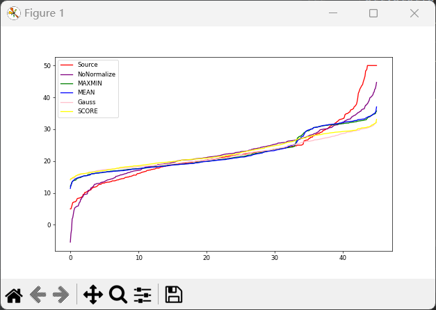
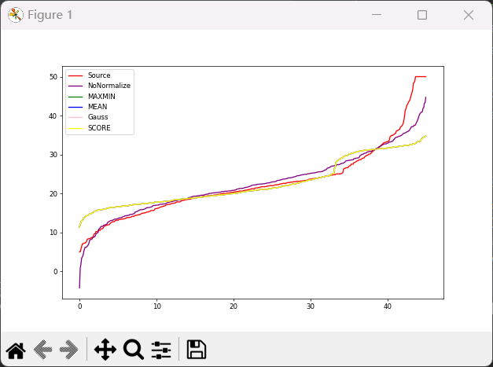

# Boston Housing

## Introduce:

​		我们都知道，线性回归模型。一般是用来做一个预测，我们简单来回顾一下他的推导过程。首先，我们定义一个回归的函数：

$$
f(X)=Y^p
$$

这里的X和Y都是以向量的形式给出：

$$
X=[x_1,x_2.x_3...x_i]
$$


$$
x_i=[v_1,v_2,v_3...v_m]^T
$$


这里的v<sub>i</sub>为实数，是向量x<sub>i</sub>的某一个具体特征。

$$
Y=[y_1,y_2,y_3...y_n]^T
$$

这里的y<sub>i</sub>为一个具体的实数。假设现在我们给定数据集合（X,Y），那么我们希望可以通过这个数据集来找到一个函数，让我们得以取预测未来的一些事情。现在我们来构造这个方程

$$
f(X)=X^TW+B
$$


$$
Loss=||(Y-f(X))||^2
$$

因为我们的数据集是提前已经知道了X和Y，所以我们这里要求的变成了W和b,同时为了方便计算，我们将w拓展一个维度，当作b，X拓展一个特征当作‘1’。将上面两个函数整合一下就是这样的：

$$
Loss(W)=||Y-X^TW||^2
$$

很显然我们就是要找到一个可以使Loss的值最小的W。

$$
W:\mathop{inf}\limits_{w}||Y-W^TX||^2
$$


## Experiment content:

### Briefly:

​		本次要做的实验内容是波士顿房价的预测,使用网上现有的数据集，和一个集成的机器学习框架Script-learn框架。这个相对来说比自己写要容易那么一点。但是，自己写方便写实验报告，所以我们来自己写。

### Result:

​		我们先来看一下结果，再看代码。我们对比了四种特征缩的方式来观察哪一种效果最好。已经两种求解最优化的方法。嗯，，先来看结果吧：





第一幅图是在梯度下降法的基础上进行的四次数据标准化的对比图像，从图像的结果上，可以看出来，还是没有进行标准化的数据结果相对来说更好一点。而在第二幅图里面，用标准方程法做出来的图像显示，用数据标准化后的数据做实验，竟然，他们最后竟然都重合了。


### Pipe Line:

​		1>首先我们来分析一下这个框架的基本结构，当然我们这里用到的是Linear_model。我们来简要分析一个它的一个函数格式。额，他这个封装的太厚了，我们还是直接来自己写吧。

​		2>首先呢，第一部分，无可厚非的坑定是加载数据，我们从url上把数据读到我们的程序里面。所以这里运行此程序需要进行联网的一个活动。

```python
####----------加载波士顿房价预测数据集-------------------######
data_url = "http://lib.stat.cmu.edu/datasets/boston"   ####数据所在的url
raw_df = pd.read_csv(data_url, sep="\s+", skiprows=22, header=None) ###将数据读入
data = np.hstack([raw_df.values[::2, :], raw_df.values[1::2, :2]])  ###将X的值划分给data
target = raw_df.values[1::2, 2]           ###将Y的值划分给target
```

在这一部分呢，他返回了样本X和样本值Y，我们来看一下他的格式吧，首先这是X的格式，一共是13个特征。

​							[[6.3200e-03 1.8000e+01 2.3100e+00 ... 1.5300e+01 3.9690e+02 4.9800e+00]
​							 [2.7310e-02 0.0000e+00 7.0700e+00 ... 1.7800e+01 3.9690e+02 9.1400e+00]
 							[2.7290e-02 0.0000e+00 7.0700e+00 ... 1.7800e+01 3.9283e+02 4.0300e+00]
 							...
​							 [6.0760e-02 0.0000e+00 1.1930e+01 ... 2.1000e+01 3.9690e+02 5.6400e+00]
 							[1.0959e-01 0.0000e+00 1.1930e+01 ... 2.1000e+01 3.9345e+02 6.4800e+00]
​							 [4.7410e-02 0.0000e+00 1.1930e+01 ... 2.1000e+01 3.9690e+02 7.8800e+00]]

再来看一下Y的格式，当然这里只取其中的一部分，因为全部的，实在太长了。

​							[11.9 27.9 17.2 27.5 15.  17.2 17.9 16.3  7.   7.2  7.5 10.4  8.8  8.4
 							16.7 14.2 20.8 13.4 11.7  8.3 10.2 10.9 11.   9.5 14.5 14.1 16.1 14.3
 							11.7 13.4  9.6  8.7  8.4 12.8 10.5 17.1 18.4 15.4 10.8 11.8 14.9 12.6
 							14.1 13.  13.4 15.2 16.1 17.8 14.9 14.1 12.7 13.5 14.9 20.  16.4 17.7
 							19.5 20.2 21.4 19.9 19.  19.1 19.1 20.1 19.9 19.6 23.2 29.8 13.8 13.3
 							16.7 12.  14.6 21.4 23.  23.7 25.  21.8 20.6 21.2 19.1 20.6 15.2  7.
  							8.1 13.6 20.1 21.8 24.5 23.1 19.7 18.3 21.2 17.5 16.8 22.4 20.6 23.9 11.9]

​		3>将数据读进来以后，很显然是不能直接用的，当然也可以直接用。但是为了我们方便进行梯度下降，我们将X的维度拓展1，这样就可以将b放入w的矩阵里面了。

```python
for item in data.tolist():
    item.append(1)
    _x.append(item)                 ##将训练样本的维度扩展一个为1的维度
```

同时我们为weight赋予一个初始的值，将它的维度也扩展1，来进行储存b的值。

```python
for i in range(len(data[0])):
    weight.append(random.randint(1,10)) #为权重赋值
weight.append(random.randint(1,10))     #拓展维度。
```

​	 4>弄完了这个数据处理的部分，我们就要进行梯度下降法，或者是牛顿法，标准方程法，来进行最优值的求解，但是通过观察各个属性值，不难发现，他们的值之间的变化是很大的。这可能会对求解带来一些不好的影响。因此我们对这些数据进行一个归一化的处理，或者说是特征的缩放。不过，特征缩放的方法有好多种，至于哪一种最好，试一试才能知道。再此之前，先来设置一下优化方法。首先第一种就是我们常见的梯度下降的方法，
$$
W=W- \alpha X(X^TW-Y)
$$

```python
if mode=="Grad":
    #####----定义一些需要的数据-----#####
    random.seed(100)
    learningRate = 0.00000001  # 初始化学习率
    weight = []
    for i in range(len(data[0])):
        weight.append(random.randint(1, 10))  # 为权重赋值
    weight.append(random.randint(1, 10))  ##将weight的维度扩展1，方便进行bais的运算
    #####----开始梯度下降---------#######
    weight=np.matrix(weight)   ########我们创建了一个行向量，
    _x=np.matrix(_x)
    _y=np.matrix(_y)
    cost,precost=1,0
    while cost>0.01:
        weight=weight-learningRate*(weight*_x.T-_y)*_x  ###梯度下降
        cost=np.sqrt((weight*_x.T-_y)*(weight*_x.T-_y).T)
        cost=cost/len(_y)
        print(cost)
        if abs(cost-precost)<0.00001:
            break
        precost=cost
    return weight
```

​			第二种我们来介绍标准方程法。我们知道了上面有优化函数：

$$
Loss(W)=||Y-X^TW||^2
$$

这个式子是一个关于w的函数。凭借我们的第一感觉，如果要我们求它的极大值点或者极小值点，坑定是对它进行求导，然后让它的导数等于0。而在这里，我们也是可以这样做的。因为我们可以看到这是一个二次的函数，并且由于它的每一个二次项都是平方得来的，所以它的二次项系数一定是正数，很明显这是一个凸函数。就像下面这样

$$
F(x)=(x-a)^2=x^2+2ax+a^2
$$

因此我们只需要对W进行求导，让其导数等于0，就能得到我们的最优解。但是，这里的W是以一个向量的形式纯在的，所以我们就涉及到了向量求导的问题。我们来简单的推导一下子：

$$
Loss(W)=\frac{1}{2}||Y-X^TW||^2
$$


$$
Loss(W)=\frac {1}{2}(Y-X^TW)^T(Y-X^TW)
$$


$$
Loss(W)=\frac {1}{2}(Y^T-W^TX)(Y-X^TW)
$$


$$
Loss(W)=\frac {1}{2}(Y^TY-Y^TX^TW-W^TXY+W^TXX^TW)
$$


要求它的导数，我们需要利用向量求导的几个性质：


$$
\frac {\part W^TDW} {\part W}=(D+D^T)W
$$


$$
\frac {\part D^TW} {\part W}=D
$$


$$
\frac {\part W^TD} {\part W}=D
$$


那么利用这几个函数求导的性质我们可以计算出：

$$
\frac{\part L}{\part W}=\frac {1}{2}[(XX^T+XX^T)W-2XY)]=XX^TW-XY=X(X^TW-Y)
$$

让其偏导数为0，我们可以计算出：


$$
X(X^TW-Y)=0
$$

$$
XY=XX^TW
$$

$$
W=(XX^T)^{-1}XY
$$

来看一下代码实现的过程：

```python
if mode=="Normalize":
    x=np.array(_x)
    y=np.array(_y)
    '''这里的X为行向量，上面公式的是列向量，对结果进行转置就好'''
    #计算公式：W=（XTX）(-1)XTY
    weight=np.linalg.inv((x.T@x))@x.T@y
    return weight
```


​			第三种就是牛顿法。我们来详细介绍牛顿法。现在我们已经知道了我们的优化函数是：


$$
W=argmin||Y-X^TW||
$$

$$
L(W)=||Y-X^TW||
$$

我们对函数L(W)在某一点x<sup>k</sup>处进行二阶的泰勒展开：

$$
f(x^k+d^k)=f(x^k)+\nabla f(x^k)d^k+1/2(d^k)^T\nabla^2f(x^k)d^k+O||d^k||^2
$$

对其我们忽略其高阶项：

$$
f(x^k+d^k)=f(x^k)+\nabla f(x^k)d^k+1/2(d^k)^T\nabla^2f(x^k)d^k
$$

因为该展开式是一个二阶的函数，简单来说就是一个二次函数。因为某一个点的具体值和其一阶导数，二阶导数都是知道的，其未知数只有d<sup>k</sup>,而这个关于d<sup>k</sup>的函数是一个二次的函数。既然是一个二次的函数，那么不难想到，如果这是一个凸函数的话，我们只要让其导数为0，就可以求得它的极小值点，而这个极小值点，相对与我们的原函数来说，就是（x<sup>k</sup>+d<sup>k</sup>）点，那么这个d<sup>k</sup>不就是我们要找的一个可以让其原函数最小化的一个方向吗？很显然是这个样子的。那么下面我们对上面的泰勒展开式进行求导并让其导数为零，得到：

$$
\nabla f(x^k)=-\nabla^2f(x^k)d^k
$$

那么我们要求d<sup>k</sup>就是：

$$
d^k=-\nabla^2f(x^k)^{-1}\nabla f(x^k)
$$

那么我们的迭代式就是:

$$
x^{k+1}=x^k-\nabla^2f(x^k)^{-1}\nabla f(x^k)
$$

这里呢，我们选取了步长为恒定为1，这样的，步长为1的方法，我们叫它经典牛顿法。不过，在这里我们还有一个问题，就是关于这个二次函数的开口问题，只有当它的开口是向下的，也就是二次项系数为大于零的，也就是，我们泰勒展开式的二次项系数为大于0的，也就是，在x<sup>k</sup>点处的海瑟矩阵正定的，那么我们的牛顿方向d<sup>k</sup>，才是可以使函数值下降的，那么海瑟矩阵不正定怎么办？很简单，那就是想办法把他变成正定的一个矩阵。我们都知道，正定矩阵的对角线元素一定是大于0的，那么为啥不用这个性值来构建我们想要的正定矩阵呢？当然是可以的，这很容易理解。我们让他加上一个小矩阵，使其正定：

$$
B^k=\nabla^2f(x^k)+E^k
$$

这样的话，我们就得到了经过修正的一个海瑟矩阵B<sup>k</sup>，所以d<sup>k</sup>就可以写成这个样子的：

$$
d^k=-{B^k}^{-1}\nabla f(x^k)
$$

再来好好看一下这个式子，让我们想一下，他貌似有点太过简单了。所以，凭借我们20多年的直觉来看，坑定有不足的地方。那哪里有呢？应该是只有E<sup>k</sup>了，因为我们只创造了这一个东西。哦，对，我们应该找一个什么样子的E<sup>k</sup>呢？，换句话说就是E<sup>k</sup>应该满足什么条件呢？我认为我们应该让这个E<sup>k</sup>，尽可能的小，因为他越小对我们原来的海瑟矩阵的影响就越小。同时我们知道一个性质，就是正定矩阵的对角线元素都是大于0的。而对角线元素都大于0的矩阵一定是正定矩阵，所以再这里我们只研究矩阵E<sup>k</sup>的对角线元素。因此我们可以把他写成这个形式：

$$
E^k=\alpha^k I
$$

其中I是单位矩阵。α<sup>k</sup>，为每一次迭代过程中取的矩阵的大小。

​		上面我们提到了，牛顿法的步长我们选取它恒定为1，这样的作法显示不是很妥当的。因此我们引入一种线搜索算法来确定每一次下降的步长，但是在这里我们不对线搜索算法展开太多的分析。下面我们总结一下，修正牛顿法的算法实现流程：

$$
\begin{cases}
1> 给定初始点x^0 \\
2> while(case)\\
3>    确定矩阵B^k   \\
4>    求解下降方向d^k \\
5>    确定步长 \\
6>    x^{k+1}=x^k+ad^k
\end{cases}
$$

这个在整体上来说还是需要求解一个海瑟矩阵的，很明显目前还有点不会求。本来以为我是能求出来的，但是后来发现我好像求不出来，也不是求不出来吧，就是时间有点紧。作业实在太多了，这里就不展开讨论牛顿法了。但是代码的布局我还是写了的，因为刚开始的时候，我是真的打算取做一下这三种优化方法的对比的。

```python
if mode=='Newton':
    random.seed(100)
    learningRate = 1  # 初始化步长
    weight = []
    for i in range(len(data[0])):
        weight.append(random.randint(1, 10))  # 为权重赋值
    weight.append(random.randint(1, 10))  ##将weight的维度扩展1，方便进行bais的运算
    '''海瑟矩阵不知道怎么求了，
        本来以为我能求出来的，
        其实时间充裕一点还是
        能求出来的，但是时间有
        点紧张，所以就不做这种
        优化方法了
'''
```

​	5>最后一个部分就是数据可视化的部分，为了方便观察，我们取他们的y值按照从小到大顺序排列，x值取均等间隔就好。这里把4种缩放的方法放在一起画图，所以代码有点长。

```python
#################未缩放###########################
weight=fit(_x,_y,mode="Normalize")
weight=np.matrix(weight)   ########我们创建了一个行向量，
####---------------------画图-----------------######
_x=np.matrix(_x)
_YPredict=weight*_x.T          ##预测出的y的值
maxdata=np.max(_y)             #取y的最大值和最小值
mindata=np.min(_y)
length=maxdata-mindata          #获取最大值和最小值的长度
_y=np.sort(_y)
a=np.arange(0,length,length/len(_y))
_yPredict=np.sort(_YPredict.tolist()[0])

ClassFeature=Feature_scaling(_x,_y)
#########最大最小值缩放#################################
_x,_y=ClassFeature.MaxMin()
weight=fit(_x,_y,mode="Normalize")
weight=np.matrix(weight)   ########我们创建了一个行向量，
####---------------------画图-----------------######
_x=np.matrix(_x)
_YPredict=weight*_x.T          ##预测出的y的值
maxdata=np.max(_y)             #取y的最大值和最小值
mindata=np.min(_y)
length=maxdata-mindata          #获取最大值和最小值的长度
_y=np.sort(_y)
a=np.arange(0,length,length/len(_y))
_yPredict_MAXMIN=np.sort(_YPredict.tolist()[0])
###################################################
#################均值缩放###########################
_x,_y=ClassFeature.Mean_normalization()
weight=fit(_x,_y,mode="Normalize")
weight=np.matrix(weight)   ########我们创建了一个行向量，
####---------------------画图-----------------######
_x=np.matrix(_x)
_YPredict=weight*_x.T          ##预测出的y的值
maxdata=np.max(_y)             #取y的最大值和最小值
mindata=np.min(_y)
length=maxdata-mindata          #获取最大值和最小值的长度
_y=np.sort(_y)
a=np.arange(0,length,length/len(_y))
_yPredict_Mean=np.sort(_YPredict.tolist()[0])

#################均值缩放###########################
_x,_y=ClassFeature.Z_score_Normalization()
weight=fit(_x,_y,mode="Normalize")
weight=np.matrix(weight)   ########我们创建了一个行向量，
####---------------------画图-----------------######
_x=np.matrix(_x)
_YPredict=weight*_x.T          ##预测出的y的值
maxdata=np.max(_y)             #取y的最大值和最小值
mindata=np.min(_y)
length=maxdata-mindata          #获取最大值和最小值的长度
_y=np.sort(_y)
a=np.arange(0,length,length/len(_y))
_yPredict_Gass=np.sort(_YPredict.tolist()[0])

#################均值缩放###########################
_x,_y=ClassFeature.Scaling_to_unit_length()
weight=fit(_x,_y,mode="Normalize")
weight=np.matrix(weight)   ########我们创建了一个行向量，
####---------------------画图-----------------######
_x=np.matrix(_x)
_YPredict=weight*_x.T          ##预测出的y的值
maxdata=np.max(_y)             #取y的最大值和最小值
mindata=np.min(_y)
length=maxdata-mindata          #获取最大值和最小值的长度
_y=np.sort(_y)
a=np.arange(0,length,length/len(_y))
_yPredict_Length=np.sort(_YPredict.tolist()[0])

#_yPredict=_YPredict.tolist()[0]
plt.figure(figsize=(5, 5), dpi=50)
#plt.scatter(a, _y,color='red',label='Real')
#plt.scatter(a,_yPredict,color='green',label='Prediect')
plt.plot(a, _y,color='red',label='Source')
plt.plot(a,_yPredict,color='purple',label='NoNormalize')
plt.plot(a,_yPredict_MAXMIN,color='green',label='MAXMIN')
plt.plot(a,_yPredict_Mean,color='blue',label='MEAN')
plt.plot(a,_yPredict_Gass,color='pink',label='Gauss')
plt.plot(a,_yPredict_Length,color='yellow',label='SCORE')
plt.legend(['Source','NoNormalize','MAXMIN','MEAN','Gauss','SCORE'])
plt.show()
```

####################################################################################################################################################################################################################################################################################################################################################################################################################################################################################################################

### All Code：

```python
import matplotlib.pyplot as plt
import pandas as pd
import numpy as np
import random
import sympy
import math
####----------加载波士顿房价预测数据集-------------------######
data_url = "http://lib.stat.cmu.edu/datasets/boston"   ####数据所在的url
raw_df = pd.read_csv(data_url, sep="\s+", skiprows=22, header=None) ###将数据读入
data = np.hstack([raw_df.values[::2, :], raw_df.values[1::2, :2]])  ###将X的值划分给data
target = raw_df.values[1::2, 2]           ###将Y的值划分给target

#-------------数据处理-------------------------------######

_x,_y=[],[]
_y=target
for item in data.tolist():
    item.append(float(1))
    _x.append(item)                 ##将训练样本的维度扩展一个为1的维度

#-------------样本数据参差不齐，我们对其进行归一化处理--------------###

class Feature_scaling:

    def __init__(self,_dataset,_target):
        self._dataset=_dataset
        self._target=_target

    def MaxMin(self):
        #最大值最小值缩放
        #这里有一些数据的值相差过大，不太容易把他们变成0，1范围内的数值
        #所以这里把他们缩放到10-20范围内
        _x=np.array(self._dataset)
        _y=np.array(self._target)
        _x=_x.T
        _x_Fixed=[]
        for item in _x:
            #让数据的每一列除以他们的最大值最小值之差
            if (np.max(np.array(item))-np.min(np.array(item)))==0:
                _x_Fixed.append(item)
            else:
                _x_Fixed.append(((item-np.min(np.array(item)))/(np.max(np.array(item))-np.min(np.array(item))))*10+10)
            _x=np.array(_x_Fixed).T
        return _x,_y

    def Mean_normalization(self):
        '''# 均值缩放
           # 这里有一些数据的值相差过大，不太容易把他们变成0，1范围内的数值
           # 同样的这里把他们缩放到10-20范围内
           # 这个和上面的最大最小值缩放没有多大区别'''
        _x = np.array(self._dataset)
        _y = np.array(self._target)
        _x = _x.T
        _x_Fixed = []
        for item in _x:
            if (np.max(np.array(item)) - np.min(np.array(item))) == 0:
                _x_Fixed.append(item)   #最后一列是我们加上去用来拟合B的，这里不做考虑对其缩放
            else:
                _x_Fixed.append(((item - np.mean(np.array(item))) / (np.max(np.array(item)) - np.min(np.array(item)))) * 10 + 10)
            _x = np.array(_x_Fixed).T
        return _x, _y

    def Z_score_Normalization(self):
        '''这种标准化方法也叫高斯归一化，
        他就是将数据的每一个特征值
        转换为均值为0
        标准差为1的数据'''
        _x_Fixed=[]
        _x=np.array(self._dataset)
        _y=np.array(self._target)
        for item in _x.T:
            avg=np.mean(np.array(item))  #求均值
            avr=np.var(np.array(item))   #求方差
            if (np.max(np.array(item)) - np.min(np.array(item))) == 0:
                _x_Fixed.append(item)   #最后一列是我们加上去用来拟合B的，这里不做考虑对其缩放
            else:
                _x_Fixed.append((np.array(item)-avg)/avr)
        _x=np.array(_x_Fixed).T

        return _x,_y
    def Scaling_to_unit_length(self):
        '''该方法，就是用当前特征值，除以
        当前特征维度的欧几里得长度，
        其实就是长度，不同情况不同分析把'''
        _x_Fixed=[]
        _x=np.array(self._dataset)
        _y=np.array(self._target)
        for item in _x.T:

            if (np.max(np.array(item)) - np.min(np.array(item))) == 0:
                _x_Fixed.append(item)   #最后一列是我们加上去用来拟合B的，这里不做考虑对其缩放
            else:
                #为了计算方便，我们取它的无穷范数
                _x_Fixed.append((np.array(item))/np.max(np.array(item)))
                #_x_Fixed.append((np.array(item)) / 10)
        _x=np.array(_x_Fixed).T

        return _x,_y

#-------------
def fit(_x,_y,mode="Grad"):
    if mode=="Grad":
        #####----定义一些需要的数据-----#####
        random.seed(100)
        learningRate = 0.00000001  # 初始化学习率
        weight = []
        for i in range(len(data[0])):
            weight.append(random.randint(1, 10))  # 为权重赋值
        weight.append(random.randint(1, 10))  ##将weight的维度扩展1，方便进行bais的运算
        #####----开始梯度下降---------#######
        weight=np.matrix(weight)   ########我们创建了一个行向量，
        _x=np.matrix(_x)
        _y=np.matrix(_y)
        cost,precost=1,0
        while cost>0.01:
            weight=weight-learningRate*(weight*_x.T-_y)*_x  ###梯度下降
            cost=np.sqrt((weight*_x.T-_y)*(weight*_x.T-_y).T)
            cost=cost/len(_y)
            print(cost)
            if abs(cost-precost)<0.00001:
                break
            precost=cost
        return weight

    if mode=='Newton':
        random.seed(100)
        learningRate = 1  # 初始化步长
        weight = []
        for i in range(len(data[0])):
            weight.append(random.randint(1, 10))  # 为权重赋值
        weight.append(random.randint(1, 10))  ##将weight的维度扩展1，方便进行bais的运算
        '''海瑟矩阵不知道怎么求了，
            本来以为我能求出来的，
            其实时间充裕一点还是
            能求出来的，但是时间有
            点紧张，所以就不做这种
            优化方法了
    '''

    if mode=="Normalize":
        x=np.array(_x)
        y=np.array(_y)
        #计算公式：W=（XTX）(-1)XTY
        weight=np.linalg.inv((x.T@x))@x.T@y
        return weight

mode='Normalize'
#################未缩放###########################
weight=fit(_x,_y,mode=mode)
weight=np.matrix(weight)   ########我们创建了一个行向量，
####---------------------画图-----------------######
_x=np.matrix(_x)
_YPredict=weight*_x.T          ##预测出的y的值
maxdata=np.max(_y)             #取y的最大值和最小值
mindata=np.min(_y)
length=maxdata-mindata          #获取最大值和最小值的长度
_y=np.sort(_y)
a=np.arange(0,length,length/len(_y))
_yPredict=np.sort(_YPredict.tolist()[0])

ClassFeature=Feature_scaling(_x,_y)
#########最大最小值缩放#################################
_x,_y=ClassFeature.MaxMin()
weight=fit(_x,_y,mode=mode)
weight=np.matrix(weight)   ########我们创建了一个行向量，
####---------------------画图-----------------######
_x=np.matrix(_x)
_YPredict=weight*_x.T          ##预测出的y的值
maxdata=np.max(_y)             #取y的最大值和最小值
mindata=np.min(_y)
length=maxdata-mindata          #获取最大值和最小值的长度
_y=np.sort(_y)
a=np.arange(0,length,length/len(_y))
_yPredict_MAXMIN=np.sort(_YPredict.tolist()[0])
###################################################
#################均值缩放###########################
_x,_y=ClassFeature.Mean_normalization()
weight=fit(_x,_y,mode=mode)
weight=np.matrix(weight)   ########我们创建了一个行向量，
####---------------------画图-----------------######
_x=np.matrix(_x)
_YPredict=weight*_x.T          ##预测出的y的值
maxdata=np.max(_y)             #取y的最大值和最小值
mindata=np.min(_y)
length=maxdata-mindata          #获取最大值和最小值的长度
_y=np.sort(_y)
a=np.arange(0,length,length/len(_y))
_yPredict_Mean=np.sort(_YPredict.tolist()[0])

#################均值缩放###########################
_x,_y=ClassFeature.Z_score_Normalization()
weight=fit(_x,_y,mode=mode)
weight=np.matrix(weight)   ########我们创建了一个行向量，
####---------------------画图-----------------######
_x=np.matrix(_x)
_YPredict=weight*_x.T          ##预测出的y的值
maxdata=np.max(_y)             #取y的最大值和最小值
mindata=np.min(_y)
length=maxdata-mindata          #获取最大值和最小值的长度
_y=np.sort(_y)
a=np.arange(0,length,length/len(_y))
_yPredict_Gass=np.sort(_YPredict.tolist()[0])

#################均值缩放###########################
_x,_y=ClassFeature.Scaling_to_unit_length()
weight=fit(_x,_y,mode=mode)
weight=np.matrix(weight)   ########我们创建了一个行向量，
####---------------------画图-----------------######
_x=np.matrix(_x)
_YPredict=weight*_x.T          ##预测出的y的值
maxdata=np.max(_y)             #取y的最大值和最小值
mindata=np.min(_y)
length=maxdata-mindata          #获取最大值和最小值的长度
_y=np.sort(_y)
a=np.arange(0,length,length/len(_y))
_yPredict_Length=np.sort(_YPredict.tolist()[0])

#_yPredict=_YPredict.tolist()[0]
plt.figure(figsize=(10, 10), dpi=50)
#plt.scatter(a, _y,color='red',label='Real')
#plt.scatter(a,_yPredict,color='green',label='Prediect')
plt.plot(a, _y,color='red',label='Source')
plt.plot(a,_yPredict,color='purple',label='NoNormalize')
plt.plot(a,_yPredict_MAXMIN,color='green',label='MAXMIN')
plt.plot(a,_yPredict_Mean,color='blue',label='MEAN')
plt.plot(a,_yPredict_Gass,color='pink',label='Gauss')
plt.plot(a,_yPredict_Length,color='yellow',label='SCORE')
plt.legend(['Source','NoNormalize','MAXMIN','MEAN','Gauss','SCORE'])
plt.show()
```
